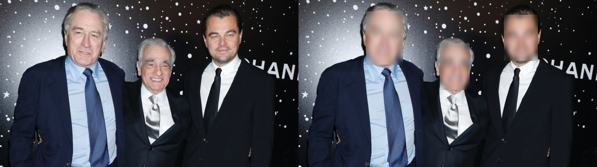

# Face Anonymizer

A python to project to blur or pixelate faces on images or live videos from the webcam using OpenCV.

## How to Use

- Install required packages with `pip install -r requirements.txt`
- Pass the arguments mentioned below to run the files

To apply on images:

`python3 image_filter.py --image 'image_path' --method ['pixelated' or 'blur'] `

To use on live video webcams:

`python3 video_filter.py --method ['pixelated' or 'blur']  `

## Image Demo

|   Before and After Applying Blur Filter    |
| :----------: |
| |

|          Before and After Applying Pixelate Filter          |
| :----------------------------------------------------------: |
|  |

